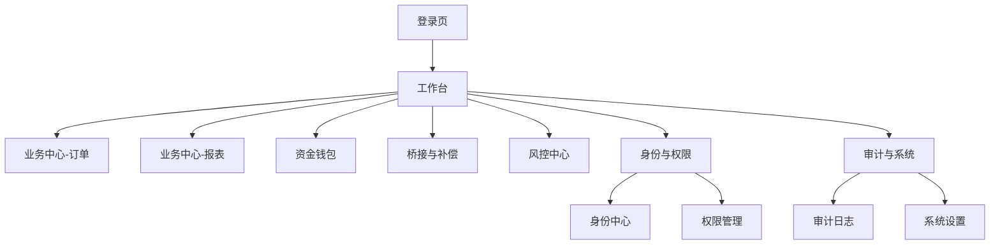

## 1. Product Overview
面向运营/财务/风控等内部人员的统一管理后台，通过权限动态展示菜单与可操作按钮。
本次输出聚焦“管理分类 + 信息架构（IA）+ 导航与页面映射”，用于指导现有后台菜单重构与页面拆分/合并。

## 2. Core Features

### 2.1 User Roles
| 角色 | 注册/登录方式 | Core Permissions |
|------|--------------|------------------|
| 超级管理员（SA） | identity 统一登录（SSO） | 全量菜单/页面/按钮；配置权限模型；审计全量 |
| 运营（OPS） | identity 统一登录（SSO） | 查询与处理业务；桥接重试；查看报表 |
| 财务（FIN） | identity 统一登录（SSO） | 钱包查询/调账/冻结解冻（按授权）；导出报表 |
| 风控（RISK） | identity 统一登录（SSO） | 风控命中审核与处置；查看策略版本 |
| 只读（VIEW） | identity 统一登录（SSO） | 只读查看被授权页面，不可执行写操作 |

### 2.2 Feature Module
新的导航信息架构（最小可用、桌面端优先）建议分为以下页面（仅列页面与核心模块）：
1. **登录页**：SSO 登录、会话失效处理。
2. **工作台**：关键指标概览、快捷入口、最近操作/告警。
3. **业务中心**：订单查询与详情；报表生成与任务列表、下载/导出、失败重试。
4. **资金钱包**：余额/钱包信息；流水查询；调账/冻结/解冻/补单（按钮级权限）。
5. **桥接与补偿**：桥接单查询与详情；重试/补偿/回滚（按钮级权限）。
6. **风控中心**：命中与处置队列；审批通过/拒绝；策略版本查看。
7. **身份与权限**：身份信息查询（会话/授权）；用户/角色/菜单与路由/权限点维护。
8. **审计与系统**：操作审计检索与导出；系统设置（环境参数/回调地址/开关）；服务健康状态。

### 2.3 Page Details（页面映射 + 调整/合并/新增标注）
| Page Name | Module Name | Feature description |
|---|---|---|
| 登录页 | SSO 登录/会话管理 | 发起 SSO 登录并获取 token；刷新/续期；退出登录；无权限拦截与跳转 |
| 工作台 | 概览/快捷入口 | 展示 wallet/bridge/risk/report 核心指标；按权限渲染快捷入口；展示最近操作/告警 |
| 业务中心-订单 | 订单查询/详情 | 查询订单列表；查看订单详情；联动展示报表筛选关键字段（orderId、时间、金额/币种、状态） |
| 业务中心-报表 | 报表生成与任务 | 按条件生成报表；查看任务列表（生成中/成功/失败）；下载/导出；失败重试；筛选字段与订单对齐 |
| 资金钱包 | 余额/流水/资金操作 | 查询余额与流水；按按钮权限执行调账/冻结/解冻/补单；写操作二次确认并写入审计 |
| 桥接与补偿 | 桥接查询/补偿操作 | 查询桥接单与详情；按按钮权限执行重试/补偿/回滚；写操作二次确认并写入审计 |
| 风控中心 | 命中队列/处置 | 查看命中与处置队列；按权限审批通过/拒绝；查看策略版本 |
| 身份与权限-身份中心 | 会话/授权查询 | 查询用户/会话/授权信息；必要时触发刷新/吊销（按权限） |
| 身份与权限-权限管理 | 用户/角色/菜单/权限点 | 用户列表与角色绑定；角色新增编辑与分配权限；菜单树与路由绑定；权限点（menu/page/button）维护与导入导出 |
| 审计与系统 | 审计/系统设置 | 检索与导出审计日志（谁、何时、对什么、结果）；配置环境参数与开关；查看服务健康 |

#### 新分类导航结构（建议）
> 说明：括号内为建议二级菜单；“动作”用于标注与现有结构相比需要做的变更类型。

1) 工作台
- 工作台首页（保留）

2) 业务中心（调整：从“业务控制台”中拆分聚合到领域导航）
- 订单（调整：从 Order 分区独立为二级菜单/页面）
- 报表（调整：从 Report 分区独立为二级菜单/页面）

3) 资金钱包（调整：从“业务控制台”中拆分）
- 钱包与流水（保留功能、调整入口位置与命名）

4) 桥接与补偿（调整：从“业务控制台”中拆分）
- 桥接单（保留功能、调整入口位置与命名）

5) 风控中心（调整：从“业务控制台”中拆分）
- 风控处置（保留）

6) 身份与权限（合并 + 调整）
- 身份中心（调整：将 Identity 分区并入该一级类目）
- 权限管理（保留：用户/角色/菜单与路由/权限点）

7) 审计与系统（保留）
- 审计日志（保留）
- 系统设置（保留：环境/回调/开关/健康）

#### 需要调整/合并/新增的模块清单（结论）
- 调整（拆分重组）：将原“业务控制台（identity/wallet/bridge/order/report/risk 分区）”调整为 5 个领域入口：业务中心、资金钱包、桥接与补偿、风控中心、身份与权限。
- 合并（消除概念重复）：将“Identity 分区”与“权限与菜单管理（RBAC）”统一收敛到“身份与权限”一级类目下，减少“身份相关能力”在两个地方出现。
- 新增（仅新增导航/页面承载方式，不新增业务能力）：
  - 新增二级导航：订单、报表、身份中心（均为从旧分区抽取形成的导航项）。
  - 其余能力保持不变，仅做入口与命名调整。

## 3. Core Process
- 登录与鉴权：你通过 SSO 登录 → 获取 token → 拉取 menu/page/button 权限点 → 生成侧边栏与路由守卫 → 进入工作台。
- 日常查询与处置：你从领域菜单进入列表页 → 查询（如订单/钱包流水/桥接单/风控命中）→ 进入详情或执行写操作 → 二次确认 → 调用目标服务 → 回显结果并写入审计。
- 管理配置（SA）：你在“身份与权限”维护用户/角色/菜单/权限点 → 生效后其他角色刷新即可看到新菜单与按钮。

