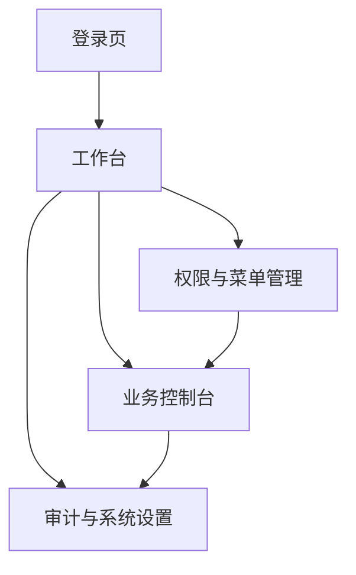

## 1. Product Overview
单一管理后台（Web）按角色动态展示菜单与可操作按钮。
面向运营/财务/风控等内部人员，统一对接 identity/wallet/bridge/report/risk 五类后端服务。

## 2. Core Features

### 2.1 User Roles
| 角色 | 注册/登录方式 | Core Permissions |
|------|--------------|------------------|
| 超级管理员（SA） | identity 统一登录（SSO） | 全量菜单/页面/按钮；配置权限模型；审计全量 |
| 运营（OPS） | identity 统一登录（SSO） | 查看/处理业务工单；桥接重试；查看报表 |
| 财务（FIN） | identity 统一登录（SSO） | 钱包相关查询/调账/冻结解冻（按授权）；导出报表 |
| 风控（RISK） | identity 统一登录（SSO） | 风控策略/命中审核；风险处置按钮 |
| 只读（VIEW） | identity 统一登录（SSO） | 只读查看所有被授权页面，不可执行写操作 |

### 2.2 Feature Module
本后台最小可用版本包含以下页面：
1. **登录页**：SSO 登录、会话失效处理。
2. **工作台**：关键指标概览、快捷入口、最近操作/告警。
3. **权限与菜单管理**：用户/角色/权限点维护；菜单与路由绑定；权限矩阵预览。
4. **业务控制台**：按服务分区（identity/wallet/bridge/report/risk）进行查询与操作。
5. **审计与系统设置**：操作审计、配置项（环境/回调地址/开关）管理。

### 2.3 Page Details
| Page Name | Module Name | Feature description |
|-----------|-------------|---------------------|
| 登录页 | SSO 登录 | 发起 identity 登录；获取 access token；失败提示与重试 |
| 登录页 | 会话管理 | 刷新/续期 token；退出登录；无权限跳转 |
| 工作台 | 概览卡片 | 展示 wallet/bridge/risk/report 核心指标（来自后端聚合接口） |
| 工作台 | 快捷入口 | 根据权限渲染快捷菜单；一键跳转到常用页面 |
| 权限与菜单管理 | 用户管理 | 查看用户列表；绑定角色；禁用/启用（如允许） |
| 权限与菜单管理 | 角色管理 | 新增/编辑角色；分配菜单/页面/按钮权限点 |
| 权限与菜单管理 | 菜单与路由 | 维护菜单树；绑定前端路由；设置可见性与排序 |
| 权限与菜单管理 | 权限点管理 | 维护资源点（menu/page/button）编码；支持批量导入/导出 |
| 业务控制台 | Identity 分区 | 查询用户/会话/授权信息；必要时触发刷新/吊销（按权限） |
| 业务控制台 | Wallet 分区 | 查询余额/流水；执行调账/冻结/解冻/补单（按权限） |
| 业务控制台 | Bridge 分区 | 查询跨系统/跨链桥接单；执行重试/补偿/回滚（按权限） |
| 业务控制台 | Report 分区 | 选择条件生成报表；下载/导出；查看生成状态 |
| 业务控制台 | Risk 分区 | 查看命中与处置队列；审批通过/拒绝；查看策略版本 |
| 审计与系统设置 | 审计日志 | 记录关键按钮操作（谁、何时、对什么、结果）；支持检索与导出 |
| 审计与系统设置 | 系统设置 | 配置环境参数与开关；查看服务健康状态 |

## 3. Core Process
- 登录与鉴权流程：你通过 identity SSO 登录 → 前端拿到 token → 调用“我的权限”接口获取 menu/page/button 权限点 → 生成侧边栏菜单与路由守卫 → 进入工作台。
- 日常操作流程：你从菜单进入业务分区页面 → 进行查询 → 若点击写操作按钮（如调账/冻结/审批/重试）则先做二次确认 → 调用后端聚合接口转发到目标服务 → 回显结果并写入审计日志。
- 管理配置流程（SA）：你进入权限与菜单管理 → 维护角色与权限点 → 发布/生效（立即或定时）→ 其他角色刷新后看到新菜单与新按钮。

### 权限矩阵（菜单/页面/按钮级，示例最小集）
> 说明：✓=允许；R=只读；—=不可见/不可用。

| 资源粒度 | 资源编码（示例） | SA | OPS | FIN | RISK | VIEW |
|---|---|---:|---:|---:|---:|---:|
| Menu | menu.dashboard | ✓ | ✓ | ✓ | ✓ | ✓ |
| Menu | menu.rbac | ✓ | — | — | — | R |
| Menu | menu.identity | ✓ | ✓ | — | — | R |
| Menu | menu.wallet | ✓ | R | ✓ | — | R |
| Menu | menu.bridge | ✓ | ✓ | — | — | R |
| Menu | menu.report | ✓ | ✓ | ✓ | ✓ | R |
| Menu | menu.risk | ✓ | R | — | ✓ | R |
| Page | /rbac/users | ✓ | — | — | — | R |
| Page | /console/wallet | ✓ | R | ✓ | — | R |
| Page | /console/risk | ✓ | R | — | ✓ | R |
| Button | user.disable | ✓ | — | — | — | — |
| Button | role.create | ✓ | — | — | — | — |
| Button | wallet.adjust | ✓ | — | ✓ | — | — |
| Button | wallet.freeze | ✓ | — | ✓ | — | — |
| Button | bridge.retry | ✓ | ✓ | — | — | — |
| Button | report.export | ✓ | ✓ | ✓ | ✓ | — |
| Button | risk.approve | ✓ | — | — | ✓ | — |
| Button | risk.reject | ✓ | — | — | ✓ | — |
