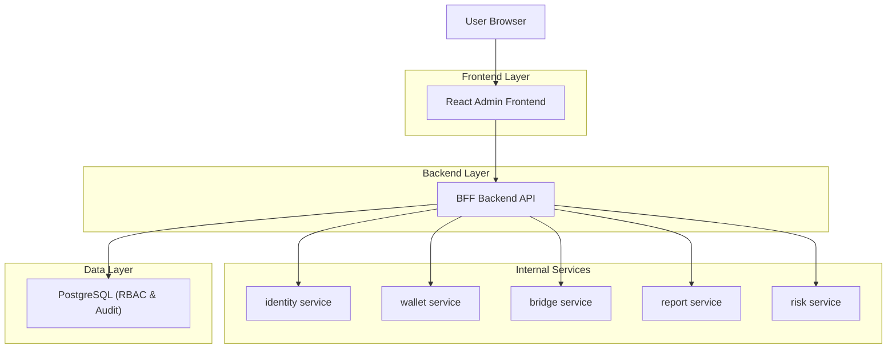
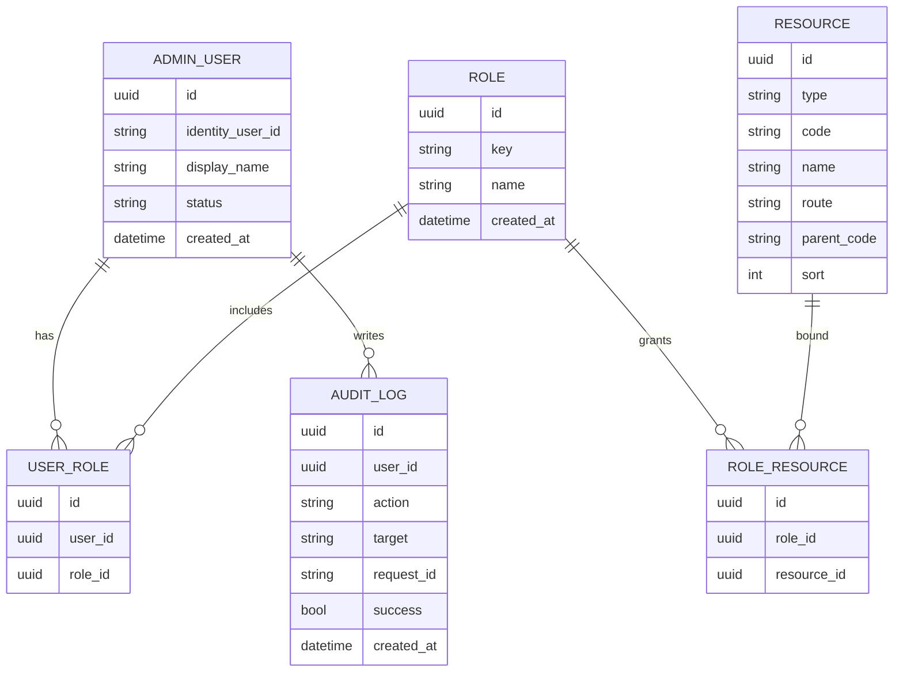

## 1.Architecture design


## 2.Technology Description
- Frontend: React@18 + TypeScript + vite + Ant Design（后台组件库）
- Backend: Node.js + NestJS（BFF 聚合层）
- Database: PostgreSQL（存 RBAC/菜单/审计；不承载核心业务数据）

## 3.Route definitions
| Route | Purpose |
|-------|---------|
| /login | identity SSO 登录与回跳 |
| / | 主框架（顶部栏+侧边栏+内容区），根据权限生成菜单 |
| /dashboard | 指标概览与快捷入口 |
| /rbac/users | 用户与角色绑定 |
| /rbac/roles | 角色维护与分配权限点 |
| /rbac/resources | 菜单/路由/按钮权限点维护 |
| /console/identity | identity 查询与必要操作 |
| /console/wallet | wallet 查询与资金类操作 |
| /console/bridge | bridge 单据查询与重试/补偿 |
| /console/report | 报表生成、下载、导出 |
| /console/risk | 风控命中队列与审批 |
| /audit | 审计日志检索与导出 |
| /settings | 系统配置与服务健康 |

## 4.API definitions (If it includes backend services)
### 4.1 Shared TypeScript types
```ts
export type RoleKey = 'SA' | 'OPS' | 'FIN' | 'RISK' | 'VIEW'
export type ResourceType = 'menu' | 'page' | 'button'
export interface Resource {
  id: string
  type: ResourceType
  code: string // e.g. wallet.adjust
  name: string
  route?: string // for page
  parentCode?: string // for menu tree
}
export interface MeResponse {
  userId: string
  displayName: string
  roles: RoleKey[]
  resources: Array<Pick<Resource,'type'|'code'|'route'>>
}
export interface AuditLog {
  id: string
  userId: string
  action: string
  target?: string
  requestId: string
  success: boolean
  createdAt: string
}
```

### 4.2 Core API（BFF）
- 获取当前用户与权限（用于菜单/路由/按钮渲染）
  - GET /api/me
- RBAC 管理
  - GET /api/rbac/users
  - PATCH /api/rbac/users/:id/roles
  - CRUD /api/rbac/roles
  - CRUD /api/rbac/resources
- 业务聚合（对接五类服务；BFF 负责鉴权、签名/头部拼装、审计落库、错误码统一）
  - POST /api/console/wallet/adjust
  - POST /api/console/wallet/freeze
  - POST /api/console/bridge/retry
  - POST /api/console/report/export
  - POST /api/console/risk/decision

## 6.Data model(if applicable)
### 6.1 Data model definition


### 6.2 Data Definition Language
```sql
CREATE TABLE admin_users (
  id UUID PRIMARY KEY DEFAULT gen_random_uuid(),
  identity_user_id TEXT UNIQUE NOT NULL,
  display_name TEXT NOT NULL,
  status TEXT DEFAULT 'active',
  created_at TIMESTAMPTZ DEFAULT now()
);

CREATE TABLE roles (
  id UUID PRIMARY KEY DEFAULT gen_random_uuid(),
  key TEXT UNIQUE NOT NULL,
  name TEXT NOT NULL,
  created_at TIMESTAMPTZ DEFAULT now()
);

CREATE TABLE resources (
  id UUID PRIMARY KEY DEFAULT gen_random_uuid(),
  type TEXT NOT NULL, -- menu/page/button
  code TEXT UNIQUE NOT NULL,
  name TEXT NOT NULL,
  route TEXT,
  parent_code TEXT,
  sort INT DEFAULT 0
);

CREATE TABLE user_roles (
  id UUID PRIMARY KEY DEFAULT gen_random_uuid(),
  user_id UUID NOT NULL,
  role_id UUID NOT NULL
);

CREATE TABLE role_resources (
  id UUID PRIMARY KEY DEFAULT gen_random_uuid(),
  role_id UUID NOT NULL,
  resource_id UUID NOT NULL
);

CREATE TABLE audit_logs (
  id UUID PRIMARY KEY DEFAULT gen_random_uuid(),
  user_id UUID NOT NULL,
  action TEXT NOT NULL,
  target TEXT,
  request_id TEXT NOT NULL,
  success BOOLEAN NOT NULL,
  created_at TIMESTAMPTZ DEFAULT now()
);

-- minimal grants example
GRANT SELECT ON admin_users,roles,resources,user_roles,role_resources,audit_logs TO anon;
GRANT ALL PRIVILEGES ON admin_users,roles,resources,user_roles,role_resources,audit_logs TO authenticated;
```
