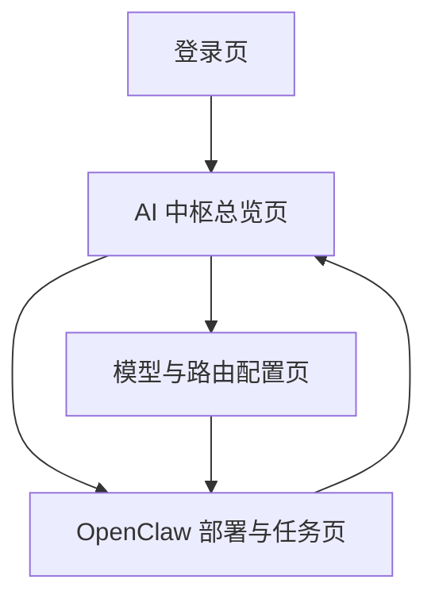

## 1. Product Overview
AI 中枢（/admin/ai/*）是面向内部管理员的统一控制台，用于配置“优先使用 NVIDIA build 模型”的推理能力，并将其纳入 OpenClaw 的部署、运行与运维闭环。
它让你用可审计、可回滚的方式完成模型接入、能力发布、任务编排与健康验证。

## 2. Core Features

### 2.1 User Roles
| 角色 | 注册/登录方式 | 核心权限 |
|------|--------------|----------|
| 超级管理员 | 由现有后台管理员创建账号/重置密码；邮箱+密码登录 | 管理所有模型提供方/密钥、OpenClaw 环境、发布与回滚、权限与审计 |
| AI 运维（MLOps/平台） | 超级管理员分配账号；邮箱+密码登录 | 配置推理服务与路由策略、管理 OpenClaw 部署与版本、执行/查看冒烟测试 |
| 业务运营 | 超级管理员分配账号；邮箱+密码登录 | 发起/停止 OpenClaw 任务、查看运行状态与日志、只读查看配置（不可改密钥） |

#### 2.1.1 职责与权限矩阵（与当前后台角色对齐）
当前项目内后台角色为 `super_admin / ops_manager / finance_manager / merchant / customer_service`，AI 中枢按“职责最小化 + 可审计”为原则，建议这样对齐：

| AI 职责域 | 负责人角色（建议） | 允许的操作边界 |
|---|---|---|
| 模型治理（提供方/路由/密钥） | `super_admin`（主）/ `ops_manager`（辅） | 仅 `super_admin` 可改密钥；`ops_manager` 可做连通性测试、发布到 OpenClaw、执行冒烟；所有变更必须写审计 |
| AI 运营（日报/活动/文案） | `ops_manager` | 可生成/编辑/发布“日报建议/文案模板/活动建议”；不可改密钥与环境认证；发布需二次确认 |
| AI 风控摘要 | `finance_manager`（主）/ `ops_manager`（辅） | 可生成高风险摘要与建议动作；可发起冻结/解冻（需按钮权限）；不可改密钥 |
| 商家 AI（后续） | `merchant` | 只读查看与商家相关的 AI 建议；不可见平台级敏感指标与密钥 |
| 客服 AI（后续） | `customer_service` | 只读查看用户摘要与建议话术；不可见利润/路由/密钥 |

权限码按三层：菜单（`menu.*`）、页面（`page.*.*`）、按钮（`button.*.*`）。AI 中枢建议使用：
- 菜单：`menu.ai`
- 页面：`page.aiOps.list`、`page.aiGrowth.list`、`page.aiRisk.list`
- 按钮（示例最小闭环）：`button.aiModels.updateKey`、`button.aiModels.testConnection`、`button.aiModels.publishToOpenClaw`、`button.aiOps.generate`、`button.aiOps.publish`、`button.aiOps.runSmoke`、`button.aiRisk.summarize`

### 2.2 Feature Module
我们的 AI 中枢需求由以下主要页面组成：
1. **登录页**：管理员登录、会话保持、退出登录。
2. **AI 中枢总览页**：环境与健康总览、快捷入口、最近发布与告警提示。
3. **模型与路由配置页**：NVIDIA build 模型优先策略、模型清单、密钥与限额、路由与降级。
4. **OpenClaw 部署与任务页**：环境管理、版本发布/回滚、任务编排/执行、运行观测、冒烟测试。

### 2.3 Page Details
| Page Name | Module Name | Feature description |
|-----------|-------------|---------------------|
| 登录页 | 登录表单 | 输入邮箱/密码登录；展示错误原因（账号不存在/密码错误/无权限）并限制重试频率 |
| 登录页 | 会话与退出 | 登录后保持会话；支持主动退出并清理本地会话信息 |
| AI 中枢总览页 | 系统健康卡片 | 展示 NVIDIA 推理可用性、OpenClaw 控制面可用性、最近一次冒烟测试结果与时间 |
| AI 中枢总览页 | 快捷操作 | 跳转到“新增模型/更新密钥”“发布到 OpenClaw”“执行冒烟测试”等最常用动作 |
| AI 中枢总览页 | 最近变更与审计摘要 | 展示最近发布、回滚、密钥更新、路由策略变更的摘要与操作者 |
| 模型与路由配置页 | 模型提供方与模型清单 | 以 NVIDIA build 为默认/优先提供方；维护可用模型列表（名称、上下文长度、能力标签、状态） |
| 模型与路由配置页 | 访问密钥与配额 | 维护 NVIDIA build/其他提供方的密钥（仅有权限角色可见）；配置请求限额与超额处理策略 |
| 模型与路由配置页 | 路由策略（优先 NVIDIA） | 配置“首选 NVIDIA build → 失败降级到备选模型”的路由链；为每条路由设置超时、重试与熔断阈值 |
| 模型与路由配置页 | 连接测试 | 对选定模型执行最小化测试请求并输出耗时/错误信息；支持一键复制请求与响应 |
| OpenClaw 部署与任务页 | 环境与连接配置 | 维护 OpenClaw 环境（dev/staging/prod）的地址、认证方式与权限；执行连通性检查 |
| OpenClaw 部署与任务页 | 发布与回滚 | 将“模型路由/能力包/任务定义”发布为版本；支持查看差异、灰度（按环境）与一键回滚 |
| OpenClaw 部署与任务页 | 任务编排与执行 | 选择任务模板/参数启动；支持停止、重试；显示运行状态（队列中/运行中/失败/完成） |
| OpenClaw 部署与任务页 | 观测与日志 | 查看按任务/版本过滤的运行日志与关键指标（耗时、错误率）；支持导出 |
| OpenClaw 部署与任务页 | 冒烟测试 | 选择环境执行标准化冒烟用例；生成结果报告（通过/失败项、建议动作）并关联到发布版本 |

## 3. Core Process
### 3.1 超级管理员 / AI 运维（MLOps）流程
1) 登录后进入“模型与路由配置”，默认以 NVIDIA build 作为首选模型来源，录入/更新密钥与配额。 
2) 配置路由链：首选 NVIDIA build；当超时/限流/错误达到阈值时，自动降级到备选模型。 
3) 在“OpenClaw 部署与任务”中选择目标环境，执行连通性检查。 
4) 将当前配置打包为版本并发布（可先 dev → staging → prod）。 
5) 发布后立即执行该环境冒烟测试；若失败则回滚到上一个稳定版本，并记录原因。 

### 3.2 业务运营流程
1) 登录进入“OpenClaw 部署与任务”，选择目标环境与任务模板。 
2) 配置业务参数后启动任务；在页面观察运行状态与日志。 
3) 若异常则停止任务并通知 AI 运维查看路由/模型健康与回滚建议。 

### 3.3 页面导航流程图

