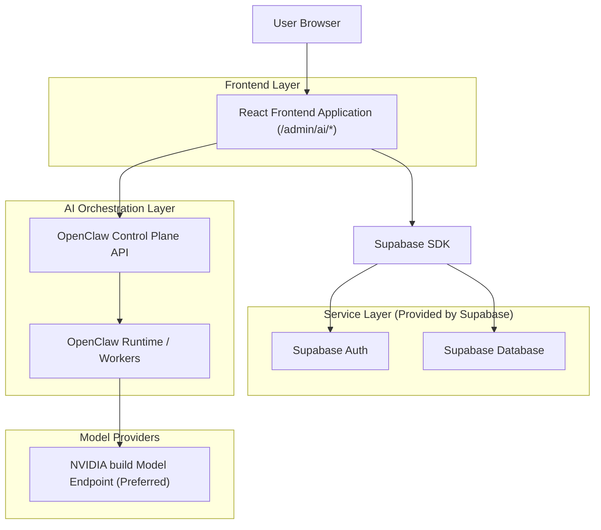
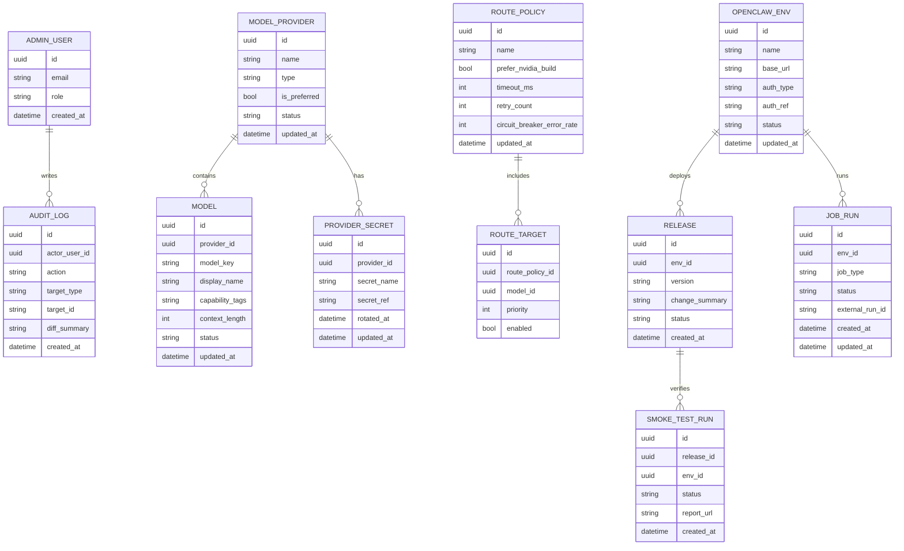

## 1.Architecture design


## 2.Technology Description
- Frontend: React@18 + TypeScript + vite + tailwindcss@3
- Backend: None（OpenClaw 作为独立编排/运行系统，通过其控制面 API 交互）
- Auth/DB: Supabase（Auth + PostgreSQL）

## 3.Route definitions
| Route | Purpose |
|-------|---------|
| /login | 管理员登录与会话初始化 |
| /admin/ai | AI 中枢总览：健康、最近发布、快捷操作 |
| /admin/ai/models | 模型与路由配置：优先 NVIDIA build、密钥与配额、连通性测试 |
| /admin/ai/openclaw | OpenClaw 部署与任务：发布/回滚、任务执行、日志与冒烟测试 |

## 4.RBAC（职责权限）
当前项目内 RBAC 采用权限码字符串：
- 菜单：`menu.{resource}`
- 页面：`page.{resource}.list|show|create|edit`
- 按钮：`button.{resource}.{action}`

AI 中枢资源（与 `/admin/ai/*` 路由对齐）：
- `ai`（菜单）
- `aiOps`（/admin/ai/ops）
- `aiGrowth`（/admin/ai/growth）
- `aiRisk`（/admin/ai/risk）

建议关键按钮权限：
- 模型与路由：`button.aiModels.updateKey`、`button.aiModels.testConnection`、`button.aiModels.publishToOpenClaw`
- AI 运营：`button.aiOps.generate`、`button.aiOps.publish`、`button.aiOps.runSmoke`、`button.aiOps.viewLogs`
- AI 风控：`button.aiRisk.summarize`

实现要点：
- 前端通过 `accessControlProvider.can()` 判断是否显示菜单/页面/按钮。
- 后端（或网关）对“写操作”仍需要服务端二次校验（即使前端隐藏按钮）。

## 6.Data model(if applicable)
### 6.1 Data model definition


### 6.2 Data Definition Language
> 说明：密钥不在表中存明文；仅保存 secret_ref（指向服务器环境变量/密钥管理器/Supabase Secrets 的引用）。

User/Role（建议复用现有后台管理员体系；此处仅给 AI 中枢扩展表）
```sql
CREATE TABLE admin_user_profile (
  user_id UUID PRIMARY KEY,
  role VARCHAR(32) NOT NULL CHECK (role IN ('super_admin','ai_ops','biz_ops')),
  created_at TIMESTAMPTZ NOT NULL DEFAULT NOW()
);

CREATE TABLE audit_log (
  id UUID PRIMARY KEY DEFAULT gen_random_uuid(),
  actor_user_id UUID NOT NULL,
  action VARCHAR(64) NOT NULL,
  target_type VARCHAR(64) NOT NULL,
  target_id VARCHAR(128) NOT NULL,
  diff_summary TEXT,
  created_at TIMESTAMPTZ NOT NULL DEFAULT NOW()
);

CREATE INDEX idx_audit_log_created_at ON audit_log(created_at DESC);
CREATE INDEX idx_audit_log_actor ON audit_log(actor_user_id);

CREATE TABLE model_provider (
  id UUID PRIMARY KEY DEFAULT gen_random_uuid(),
  name VARCHAR(64) NOT NULL,
  type VARCHAR(32) NOT NULL CHECK (type IN ('nvidia_build','other')),
  is_preferred BOOLEAN NOT NULL DEFAULT FALSE,
  status VARCHAR(16) NOT NULL DEFAULT 'active' CHECK (status IN ('active','disabled')),
  updated_at TIMESTAMPTZ NOT NULL DEFAULT NOW()
);

CREATE TABLE model (
  id UUID PRIMARY KEY DEFAULT gen_random_uuid(),
  provider_id UUID NOT NULL,
  model_key VARCHAR(128) NOT NULL,
  display_name VARCHAR(128) NOT NULL,
  capability_tags TEXT NOT NULL DEFAULT '',
  context_length INTEGER,
  status VARCHAR(16) NOT NULL DEFAULT 'active' CHECK (status IN ('active','disabled')),
  updated_at TIMESTAMPTZ NOT NULL DEFAULT NOW()
);

CREATE INDEX idx_model_provider_id ON model(provider_id);
CREATE UNIQUE INDEX uq_model_provider_model_key ON model(provider_id, model_key);

CREATE TABLE provider_secret (
  id UUID PRIMARY KEY DEFAULT gen_random_uuid(),
  provider_id UUID NOT NULL,
  secret_name VARCHAR(64) NOT NULL,
  secret_ref VARCHAR(256) NOT NULL,
  rotated_at TIMESTAMPTZ,
  updated_at TIMESTAMPTZ NOT NULL DEFAULT NOW()
);

CREATE TABLE route_policy (
  id UUID PRIMARY KEY DEFAULT gen_random_uuid(),
  name VARCHAR(64) NOT NULL,
  prefer_nvidia_build BOOLEAN NOT NULL DEFAULT TRUE,
  timeout_ms INTEGER NOT NULL DEFAULT 30000,
  retry_count INTEGER NOT NULL DEFAULT 1,
  circuit_breaker_error_rate INTEGER NOT NULL DEFAULT 50,
  updated_at TIMESTAMPTZ NOT NULL DEFAULT NOW()
);

CREATE TABLE route_target (
  id UUID PRIMARY KEY DEFAULT gen_random_uuid(),
  route_policy_id UUID NOT NULL,
  model_id UUID NOT NULL,
  priority INTEGER NOT NULL,
  enabled BOOLEAN NOT NULL DEFAULT TRUE
);

CREATE INDEX idx_route_target_policy ON route_target(route_policy_id);
CREATE INDEX idx_route_target_model ON route_target(model_id);

CREATE TABLE openclaw_env (
  id UUID PRIMARY KEY DEFAULT gen_random_uuid(),
  name VARCHAR(16) NOT NULL CHECK (name IN ('dev','staging','prod')),
  base_url VARCHAR(256) NOT NULL,
  auth_type VARCHAR(16) NOT NULL CHECK (auth_type IN ('bearer_token','basic','mtls')),
  auth_ref VARCHAR(256) NOT NULL,
  status VARCHAR(16) NOT NULL DEFAULT 'active' CHECK (status IN ('active','disabled')),
  updated_at TIMESTAMPTZ NOT NULL DEFAULT NOW()
);

CREATE TABLE release (
  id UUID PRIMARY KEY DEFAULT gen_random_uuid(),
  env_id UUID NOT NULL,
  version VARCHAR(64) NOT NULL,
  change_summary TEXT,
  status VARCHAR(16) NOT NULL DEFAULT 'created' CHECK (status IN ('created','deployed','rolled_back','failed')),
  created_at TIMESTAMPTZ NOT NULL DEFAULT NOW()
);

CREATE INDEX idx_release_env_created_at ON release(env_id, created_at DESC);

CREATE TABLE job_run (
  id UUID PRIMARY KEY DEFAULT gen_random_uuid(),
  env_id UUID NOT NULL,
  job_type VARCHAR(64) NOT NULL,
  status VARCHAR(16) NOT NULL CHECK (status IN ('queued','running','succeeded','failed','stopped')),
  external_run_id VARCHAR(128),
  created_at TIMESTAMPTZ NOT NULL DEFAULT NOW(),
  updated_at TIMESTAMPTZ NOT NULL DEFAULT NOW()
);

CREATE INDEX idx_job_run_env_created_at ON job_run(env_id, created_at DESC);

CREATE TABLE smoke_test_run (
  id UUID PRIMARY KEY DEFAULT gen_random_uuid(),
  release_id UUID NOT NULL,
  env_id UUID NOT NULL,
  status VARCHAR(16) NOT NULL CHECK (status IN ('passed','failed','running')),
  report_url VARCHAR(512),
  created_at TIMESTAMPTZ NOT NULL DEFAULT NOW()
);
```

权限（最小化示例，按需补齐 RLS 策略）
```sql
GRANT SELECT ON model_provider, model, route_policy, route_target, openclaw_env, release, job_run, smoke_test_run TO anon;
GRANT ALL PRIVILEGES ON model_provider, model, route_policy, route_target, openclaw_env, release, job_run, smoke_test_run TO authenticated;
```

---

## 7.OpenClaw 部署/使用/角色职责闭环（关键）
### 7.1 部署与使用闭环（从配置到可用）
1) 接入阶段：登记 NVIDIA build Provider → 录入 secret_ref → 拉取/录入模型清单。
2) 策略阶段：配置路由（首选 NVIDIA build → 备选模型）→ 设置超时/重试/熔断。
3) 发布阶段：打包为 Release（绑定环境 dev/staging/prod）→ 调用 OpenClaw 控制面创建/更新对应配置与任务定义。
4) 验证阶段：发布后自动触发冒烟测试（标准用例集）→ 生成报告并写入 smoke_test_run。
5) 运营阶段：业务运营启动任务 → 通过 OpenClaw 运行时执行 → 持续观测日志与指标。
6) 异常阶段：失败自动降级（路由策略）→ 仍失败则回滚 Release → 记录审计与复盘项。

### 7.2 角色职责（RACI 简表）
| 工作项 | 超级管理员 | AI 运维（MLOps/平台） | 业务运营 |
|------|------------|------------------------|----------|
| 创建/分配账号与权限 | R/A | C | C |
| 维护 NVIDIA build 密钥与轮换 | A | R | I |
| 配置模型路由与降级策略 | A | R | I |
| OpenClaw 环境接入与证书/令牌更新 | A | R | I |
| 发布/回滚版本 | A | R | I |
| 冒烟测试用例维护与执行 | A | R | C |
| 日常任务启动/停止 | I | C | R |
| 故障处置与复盘 | A | R | C |

---

## 8.云服务器部署规范（面向 OpenClaw/运行时）
> 目标：让 OpenClaw 控制面与运行时在云服务器上稳定运行，并能安全访问 NVIDIA build 模型端点。

### 8.1 推荐主机基线
- 系统：Ubuntu LTS
- 运行形态：Docker Compose（单机）起步；后续可演进到 K8s
- 网络：仅暴露 OpenClaw 控制面必要端口；其余服务内网访问；启用 HTTPS

### 8.2 环境变量/密钥管理
- NVIDIA build：以环境变量注入（例如 NVIDIA_BUILD_API_KEY），不得写入镜像与仓库。
- OpenClaw 控制面访问令牌：以 auth_ref 引用（env var 或云密钥管理器路径）。

### 8.3 目录与日志
- /opt/openclaw：部署根目录
- /var/log/openclaw：运行日志（按天滚动）
- 保留：至少 7 天；必要时上送集中日志系统（可选）

---

## 9.冒烟测试脚本规范（必须可自动化）
### 9.1 目标与原则
- 目标：验证“路由优先 NVIDIA build + OpenClaw 任务可运行 + 日志可回传”三件事。
- 原则：用例少而关键；默认 60 秒内完成；失败输出可定位信息。

### 9.2 脚本形态
- 建议：Node.js（ts-node）或 Bash + curl（二选一即可），放在 ops/smoke/ 目录。
- 输入：环境（dev/staging/prod）、OpenClaw base_url、OpenClaw token、期望的 Release version。
- 输出：
  - stdout：关键步骤与 PASS/FAIL
  - 结果 JSON：包含耗时、错误码、请求 ID、Release version

### 9.3 标准检查项（最小集合）
1) OpenClaw 健康检查：GET /health（或等价）必须 200。
2) 推理连通性：调用一个最小化推理任务（固定 prompt），必须返回非空文本。
3) 路由优先验证：响应中（或日志中）能识别使用了 NVIDIA build（例如 provider=nvidia_build）。
4) 任务系统验证：启动一个短任务 → 状态转为 succeeded → 拉取日志包含关键标记。

### 9.4 示例（伪代码规范，非实现）
```bash
# smoke.sh 规范示例
# 必填：ENV_NAME OPENCLAW_BASE_URL OPENCLAW_TOKEN EXPECT_VERSION

set -euo pipefail

# 1) health
curl -fsS "$OPENCLAW_BASE_URL/health" -H "Authorization: Bearer $OPENCLAW_TOKEN"

# 2) start job
JOB_ID=$(curl -fsS "$OPENCLAW_BASE_URL/api/jobs/start" \
  -H "Authorization: Bearer $OPENCLAW_TOKEN" \
  -H "Content-Type: application/json" \
  -d '{"type":"smoke_infer","payload":{"prompt":"ping"},"expect_version":"'$EXPECT_VERSION'"}' | jq -r .job_id)

# 3) poll status (timeout 60s)
# 4) fetch logs and assert provider contains "nvidia_build"
```
