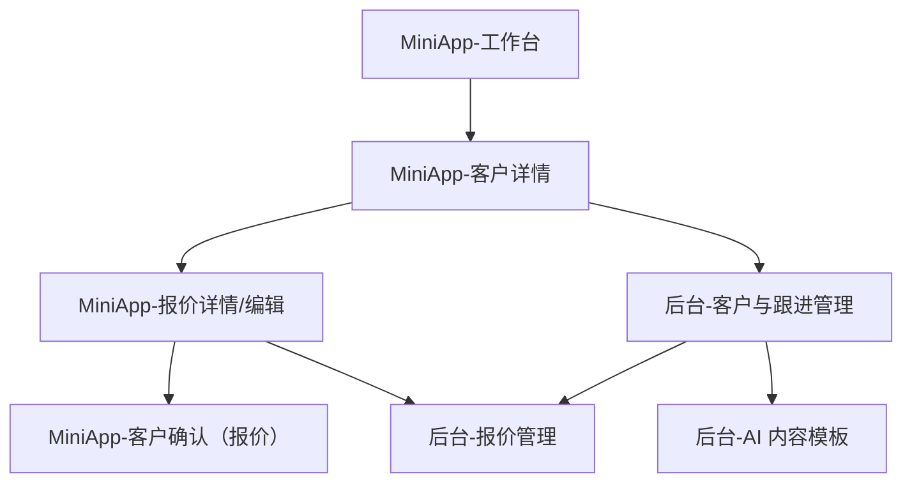

## 1. Product Overview
为 mini app 与管理后台补齐 CRM、报价、AI 文案与跟进的使用与编辑闭环。
让你从“录入客户—生成/编辑报价—发送—跟进—复盘”在两端一致流转。

## 1.1 商业底座（本质与约束）

### 一句话回答：小B客户的本质需求（拒绝表象）
在东南亚跨境链路长、清关乱、退换难的环境下，小B最大的隐性成本不是货款，而是因不确定性而消耗的管理精力与信任折损。

### 一句话回答：选品/货源必须锚定的底层标准（回到C端本质）
产品必须能成为养宠人“无需解释、即刻生效”的情感代币，且使用过程本身就在强化人宠信任纽带。

### 不可外包环节（风险红线）
- 不可外包：情感颗粒度的选品决策权；危机公关时的“身份在场”；涉及破例/补偿/调换货的最终拍板。
- 可外包/可自动化：日常沟通、跟进排程、内容批量生成与分发（需人审开关与风控）。

### 跨境分销极简公式（需求优先级依据）
跨境分销模型 = 情绪定义的溢价力 × 低熵经营的交付力 × 信任关系的节点粘性。

## 2. Core Features

### 2.1 User Roles
| 角色 | 注册/进入方式 | Core Permissions |
|------|--------------|------------------|
| 销售/顾问 | 既有账号登录 mini app | 新建/编辑客户；新增跟进；生成/编辑 AI 文案；创建/编辑/发送报价；查看客户确认状态 |
| 主管/运营（后台） | 既有后台账号登录 | 查看全量客户与报价；纠错编辑（按权限）；查看跟进质量；配置 AI 模板与字段 |
| 客户（mini app） | 通过分享链接/小程序会话进入（沿用既有登录态策略） | 查看报价；确认/拒绝；提交备注 |

### 2.2 Feature Module
本次补齐需求最小包含以下页面：
1. **MiniApp-工作台**：客户搜索/新建入口、待跟进列表、报价状态提醒。
2. **MiniApp-客户详情**：客户信息编辑、跟进记录新增、AI 跟进文案生成与编辑、报价列表。
3. **MiniApp-报价详情/编辑**：报价条目编辑、折扣/税费/备注、预览发送、客户确认。
4. **后台-客户与跟进管理**：客户库检索、分配/归属查看、跟进记录审阅与补录。
5. **后台-报价管理**：报价检索、状态流转（作废/重发）、关键字段纠错、导出（如既有）。
6. **后台-AI 内容模板**：模板新增/编辑、变量字段定义、生成记录抽查。

7. **后台-内容化选品内测**：选品候选池、内测投票/问卷、反馈阈值与结论沉淀（形成“行业风向标”内容素材）。

### 2.3 Page Details
| Page Name | Module Name | Feature description |
|-----------|-------------|---------------------|
| MiniApp-工作台 | 客户与待办 | 搜索客户；新建客户；按“待跟进/最近更新/报价待确认”聚合列表并可一键进入详情。 |
| MiniApp-客户详情 | 客户信息 | 查看并编辑基础信息（名称、联系人、电话/微信、来源、备注）；保存后立即生效。 |
| MiniApp-客户详情 | 跟进记录 | 新增跟进（方式、内容、结果、下次跟进时间）；展示时间线；支持编辑最近一条/撤回（按策略）。 |
| MiniApp-客户详情 | AI 跟进文案 | 基于客户+最近跟进生成文案；你可二次编辑；一键复制/发送（发送通道沿用既有能力）。 |
| MiniApp-客户详情 | 报价列表 | 展示该客户下报价（草稿/已发送/已确认/已拒绝/已作废）；支持新建与进入编辑。 |
| MiniApp-报价详情/编辑 | 报价编辑 | 编辑报价抬头信息（有效期、币种、条款）与明细行（名称、数量、单价、折扣）；自动计算合计。 |
| MiniApp-报价详情/编辑 | 预览与发送 | 预览报价内容；发送给客户（生成可访问链接/会话卡片）；发送前二次确认并记录审计字段（发送人/时间）。 |
| MiniApp-报价详情/编辑 | 客户确认 | 客户侧查看报价并“确认/拒绝”；可填备注；状态回写并通知销售。 |
| 后台-客户与跟进管理 | 客户库 | 按关键字段检索/筛选；查看归属销售；必要时纠错编辑（按权限）。 |
| 后台-客户与跟进管理 | 跟进审阅 | 查看客户维度跟进时间线；按时间/销售筛选；支持补录/纠错与原因标记（用于复盘）。 |
| 后台-报价管理 | 报价检索与处置 | 查看报价详情与状态；支持作废/重发；必要时纠错关键字段并写明原因。 |
| 后台-AI 内容模板 | 模板管理 | 新增/编辑模板（场景、提示词、变量）；启停生效；查看生成记录与抽查结果。 |

## 3. Core Process
### 3.1 销售/顾问（mini app）
1) 你在工作台搜索/新建客户，进入客户详情补齐信息并保存。
2) 在客户详情新增一条跟进记录，并设置“下次跟进时间”。
3) 需要对外沟通时，点击“AI 跟进文案”生成建议文本，你再编辑后复制/发送。
4) 客户有明确意向时，新建报价并编辑明细，预览无误后发送。
5) 客户在 mini app 侧确认/拒绝后，你在工作台收到状态提醒并继续跟进。

### 3.2 主管/运营（后台）
1) 你在客户库检索目标客户，查看销售归属与跟进质量。
2) 发现数据问题时按权限纠错客户/报价字段，并填写原因。
3) 你维护 AI 模板变量与启停策略，抽查生成记录，确保内容可用与合规。

### 3.3 内容化选品内测（唯一核心动作）
1) 锁定选品候选后，不直接备货；先在“小B私域社群（如50人规模博主群）”发起图文投票或预售问卷。
2) 达到阈值（建议：60% 以上愿意推、20% 以上愿意自购试用）才进入：小批量采购 + 素材制作。
3) “内测-反馈-定品”的循环产出：选品结论 + 可复用内容素材（成为行业风向标）。

