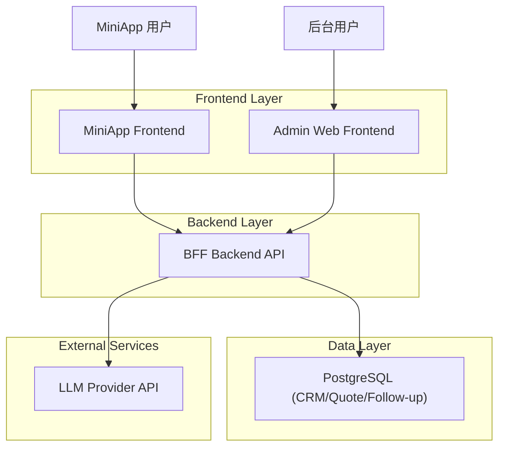
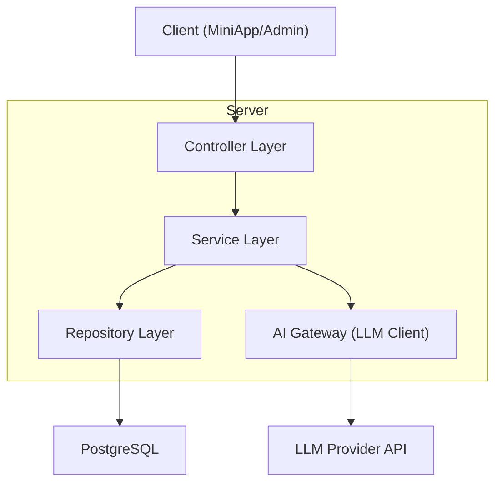
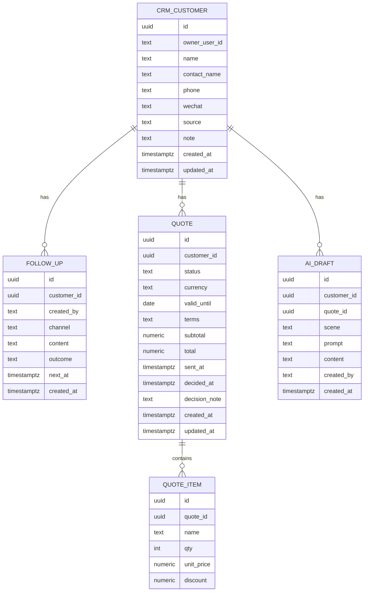

## 1.Architecture design


## 1.1 商业飞轮与系统映射

飞轮自增强闭环：
内容吸引博主/小B → 小B 产生转化数据 → 数据优化选品与内容 → 更精准内容吸引更多优质小B → 规模效应拿到更好上游资源 → 进一步强化低熵交付与情绪溢价 → 小B 形成路径依赖并口碑扩散。

对应系统组件：
- 内容：`ai-orchestrator(growth_ai)` + `ai.growth_contents` 内容池 + Admin 审核
- 数据：`bridge.bridge_events`（归因）+ `crm.leads/crm.lead_events`（线索状态机）
- 交付：订单/支付/售后流程（网关 + 供应链对接）
- 粘性：`crm.followups/outreach_logs` + n8n 定时触达 + 头部小B 1v1 人工介入

## 1.2 不可外包的安全边界（架构约束）

不可外包与必须保留人工审批权：
- 情感颗粒度选品决策：是否符合“爱意证明/情感代币”的底层标准
- 破例、补偿、调换货：必须由 Owner 终审
- 危机公关与重大舆情：必须保留身份在场

可自动化但必须风控：
- D0/D1/D3/D7 跟进触达（默认模板 + 可插入 AI 建议回复；提供人审开关）
- 内容生产与分发（提供 content 池、审核状态与追踪字段）

## 2.Technology Description
- Frontend（MiniApp）：React@18 + TypeScript（小程序/Hybrid 容器按既有方案）
- Frontend（Admin）：React@18 + TypeScript + Ant Design
- Backend：Node.js + NestJS（BFF；统一鉴权、审计、AI 调用）
- Database：PostgreSQL
- External：LLM Provider（用于生成 AI 跟进文案/报价说明；密钥仅保存在后端）

## 3.Route definitions
| Route | Purpose |
|-------|---------|
| /mini/dashboard | 工作台：待跟进、搜索、新建入口 |
| /mini/customers/:id | 客户详情：客户编辑、跟进、AI 文案、报价列表 |
| /mini/quotes/:id | 报价详情/编辑：编辑、预览、发送、确认状态 |
| /admin/crm/customers | 客户库与跟进审阅 |
| /admin/crm/quotes | 报价管理与处置 |
| /admin/ai/templates | AI 内容模板与生成记录 |

## 4.API definitions (If it includes backend services)
### 4.1 Shared TypeScript types
```ts
export type QuoteStatus = 'draft' | 'sent' | 'accepted' | 'rejected' | 'void'

export interface CrmCustomer {
  id: string
  ownerUserId: string
  name: string
  contactName?: string
  phone?: string
  wechat?: string
  source?: string
  note?: string
  createdAt: string
  updatedAt: string
}

export interface FollowUp {
  id: string
  customerId: string
  createdBy: string
  channel: 'call' | 'wechat' | 'meeting' | 'other'
  content: string
  outcome?: string
  nextAt?: string
  createdAt: string
}

export interface QuoteItem {
  id: string
  quoteId: string
  name: string
  qty: number
  unitPrice: number
  discount?: number
}

export interface Quote {
  id: string
  customerId: string
  status: QuoteStatus
  currency: string
  validUntil?: string
  terms?: string
  subtotal: number
  total: number
  sentAt?: string
  decidedAt?: string
  decisionNote?: string
  createdAt: string
  updatedAt: string
}

export interface AiGenerateRequest {
  scene: 'followup_message' | 'quote_summary'
  customerId: string
  quoteId?: string
  userHint?: string
}

export interface AiGenerateResponse {
  draftId: string
  content: string
}
```

### 4.2 Core API（BFF）
- CRM
  - GET /api/crm/customers
  - POST /api/crm/customers
  - PATCH /api/crm/customers/:id
  - GET /api/crm/customers/:id/followups
  - POST /api/crm/customers/:id/followups
- Quote
  - POST /api/quotes
  - GET /api/quotes/:id
  - PATCH /api/quotes/:id
  - POST /api/quotes/:id/send
  - POST /api/quotes/:id/void
  - POST /api/quotes/:id/decision （客户确认/拒绝）
- AI Content
  - POST /api/ai/generate
  - PATCH /api/ai/drafts/:id （你编辑后的定稿保存）

## 5.Server architecture diagram (If it includes backend services)


## 6.Data model(if applicable)

### 6.3 数据与决策最小闭环（内测-反馈-定品）

- 选品候选进入“内测队列”后，必须先走“图文投票/预售问卷”验证，再进入采购。
- 验证阈值作为可配置规则（例如：60% 愿意推、20% 自购试用）。
- 验证数据与结论沉淀为内容素材（行业风向标），并回流到增长内容与选品模型。

### 6.1 Data model definition


### 6.2 Data Definition Language
```sql
-- 不使用物理外键；通过 customer_id/quote_id 逻辑关联

CREATE TABLE crm_customers (
  id UUID PRIMARY KEY DEFAULT gen_random_uuid(),
  owner_user_id TEXT NOT NULL,
  name TEXT NOT NULL,
  contact_name TEXT,
  phone TEXT,
  wechat TEXT,
  source TEXT,
  note TEXT,
  created_at TIMESTAMPTZ DEFAULT now(),
  updated_at TIMESTAMPTZ DEFAULT now()
);

CREATE TABLE follow_ups (
  id UUID PRIMARY KEY DEFAULT gen_random_uuid(),
  customer_id UUID NOT NULL,
  created_by TEXT NOT NULL,
  channel TEXT NOT NULL,
  content TEXT NOT NULL,
  outcome TEXT,
  next_at TIMESTAMPTZ,
  created_at TIMESTAMPTZ DEFAULT now()
);
CREATE INDEX idx_followups_customer_id ON follow_ups(customer_id);
CREATE INDEX idx_followups_next_at ON follow_ups(next_at);

CREATE TABLE quotes (
  id UUID PRIMARY KEY DEFAULT gen_random_uuid(),
  customer_id UUID NOT NULL,
  status TEXT NOT NULL DEFAULT 'draft',
  currency TEXT NOT NULL DEFAULT 'CNY',
  valid_until DATE,
  terms TEXT,
  subtotal NUMERIC(18,2) NOT NULL DEFAULT 0,
  total NUMERIC(18,2) NOT NULL DEFAULT 0,
  sent_at TIMESTAMPTZ,
  decided_at TIMESTAMPTZ,
  decision_note TEXT,
  created_at TIMESTAMPTZ DEFAULT now(),
  updated_at TIMESTAMPTZ DEFAULT now()
);
CREATE INDEX idx_quotes_customer_id ON quotes(customer_id);
CREATE INDEX idx_quotes_status ON quotes(status);

CREATE TABLE quote_items (
  id UUID PRIMARY KEY DEFAULT gen_random_uuid(),
  quote_id UUID NOT NULL,
  name TEXT NOT NULL,
  qty INT NOT NULL DEFAULT 1,
  unit_price NUMERIC(18,2) NOT NULL DEFAULT 0,
  discount NUMERIC(5,4)
);
CREATE INDEX idx_quote_items_quote_id ON quote_items(quote_id);

CREATE TABLE ai_drafts (
  id UUID PRIMARY KEY DEFAULT gen_random_uuid(),
  customer_id UUID NOT NULL,
  quote_id UUID,
  scene TEXT NOT NULL,
  prompt TEXT,
  content TEXT NOT NULL,
  created_by TEXT NOT NULL,
  created_at TIMESTAMPTZ DEFAULT now()
);
CREATE INDEX idx_ai_drafts_customer_id ON ai_drafts(customer_id);
CREATE INDEX idx_ai_drafts_quote_id ON ai_drafts(quote_id);
```
