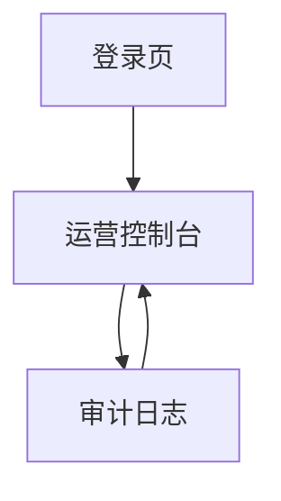

## 1. Product Overview
面向内部运营人员的管理后台占位模块：拼团、分销、奖励、黑名单、活动配置。
目标是用最少页面跑通“配置-生效-追踪-审计”的端到端运营闭环。

## 2. Core Features

### 2.1 User Roles
| 角色 | 注册/登录方式 | Core Permissions |
|------|--------------|------------------|
| 超级管理员（SA） | 统一账号登录（SSO） | 全部模块读写；发布/下线；审计全量；系统开关 |
| 运营（OPS） | 统一账号登录（SSO） | 拼团/分销/奖励/活动配置读写；不可改权限模型 |
| 风控（RISK） | 统一账号登录（SSO） | 黑名单读写；可查看其它模块；可触发“黑名单校验” |
| 只读（VIEW） | 统一账号登录（SSO） | 所有模块只读；不可执行写操作 |

### 2.2 Feature Module
最小可用版本包含以下页面：
1. **登录页**：SSO 登录、会话失效处理。
2. **运营控制台**：五个模块 Tab（拼团/分销/奖励/黑名单/活动配置），提供列表检索、创建/编辑抽屉、启用/停用、基础校验与发布确认。
3. **审计日志**：记录关键写操作；支持检索与导出。

### 2.3 Page Details
| Page Name | Module Name | Feature description |
|-----------|-------------|---------------------|
| 登录页 | SSO 登录 | 发起 SSO；处理回跳；展示失败原因并允许重试 |
| 登录页 | 会话管理 | 刷新/续期 token；退出登录；无权限跳转 |
| 运营控制台 | 全局导航与权限态 | 渲染模块 Tab 与操作按钮；无权限时隐藏/禁用并提示原因 |
| 运营控制台 | 列表检索与详情 | 按关键字段筛选；表格分页排序；点击行打开详情抽屉（基础字段 + 变更记录摘要） |
| 运营控制台-活动配置 | 配置管理 | 新增/编辑活动配置（活动类型、名称、时间窗、适用范围、开关）；保存草稿与发布生效；下线停止生效 |
| 运营控制台-拼团 | 活动管理 | 创建拼团活动并关联一个活动配置；设置成团人数/有效期/库存与状态；启用/停用；查看活动当前状态与关键指标（占位字段） |
| 运营控制台-分销 | 规则管理 | 配置分销规则（层级、比例/金额、结算周期、启用状态）；启用/停用；变更需二次确认并记录原因 |
| 运营控制台-分销 | 分销员管理 | 录入/禁用分销员（用户标识、归属、等级/层级、状态）；搜索与批量导入/导出（CSV 占位） |
| 运营控制台-奖励 | 奖励策略 | 配置奖励策略（类型、金额/比例、触发条件占位、预算上限占位、启用状态）；启用/停用 |
| 运营控制台-奖励 | 发放与追踪 | 手动发放奖励（选择用户/对象、选择策略、填写备注）；查询奖励流水与状态；支持撤销/作废（若未结算，占位规则） |
| 运营控制台-黑名单 | 名单维护 | 添加/移除黑名单（主体类型、主体标识、原因、有效期）；支持批量导入/导出；提供“立即校验”按钮返回命中结果 |
| 审计日志 | 审计检索 | 检索（时间、操作人、模块、动作、结果）；查看请求/变更摘要；导出 |

## 3. Core Process
- 登录与鉴权：你通过 SSO 登录 → 拉取你的角色与权限 → 进入运营控制台，系统按权限展示可用模块与按钮。
- 活动配置闭环：你在“活动配置”创建草稿 → 填写时间窗/范围/开关 → 预览 → 点击发布生效 → 若需停止则下线并记录原因 → 全流程写入审计。
- 拼团闭环：你创建拼团活动并关联一个“活动配置” → 设置成团规则与状态 → 启用后进入“进行中” → 运营可停用/结束（占位）→ 关键状态变更写入审计。
- 分销与奖励闭环：你配置分销规则并启用 → 维护分销员（导入/禁用）→ 配置奖励策略 → 触发方式先以“手动发放”为最小闭环 → 在奖励流水里追踪状态/撤销（占位）→ 写入审计。
- 黑名单闭环：你添加黑名单并设置有效期/原因 → 其它模块执行关键写操作前执行“黑名单校验”（占位为后台检查）→ 命中时提示并阻断或仅告警（由开关决定，占位）→ 写入审计。

