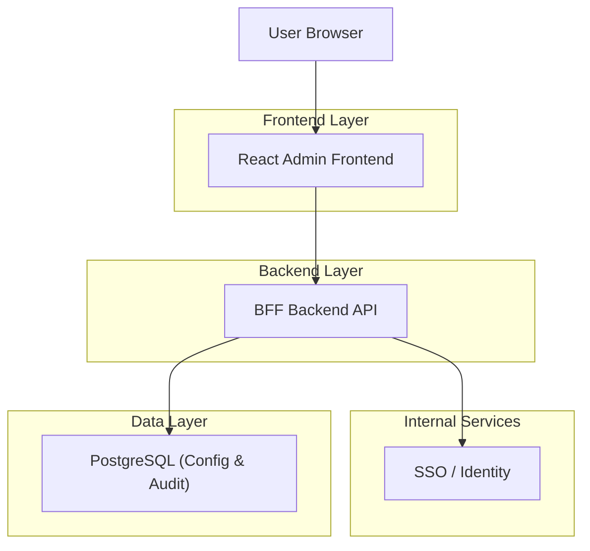
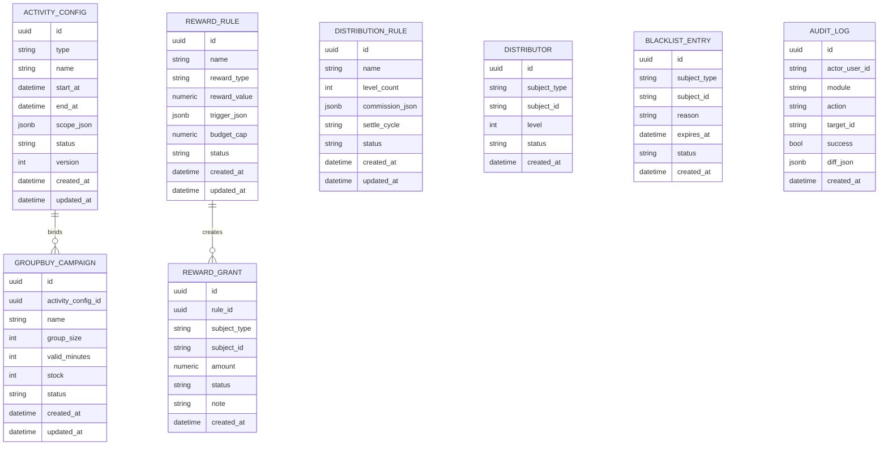

## 1.Architecture design


## 2.Technology Description
- Frontend: React@18 + TypeScript + vite + Ant Design
- Backend: Node.js + NestJS（BFF：鉴权、权限校验、审计落库、统一错误码）
- Database: PostgreSQL（仅存配置/名单/流水/审计；不承载交易核心数据）

## 3.Route definitions
| Route | Purpose |
|-------|---------|
| /login | SSO 登录与回跳处理 |
| /ops | 运营控制台：五模块 Tab（活动配置/拼团/分销/奖励/黑名单） |
| /audit | 审计日志检索与导出 |

## 4.API definitions (If it includes backend services)

### 4.1 Shared TypeScript types
```ts
export type AdminRole = 'SA' | 'OPS' | 'RISK' | 'VIEW'
export type Status = 'draft' | 'active' | 'inactive' | 'archived'

export type SubjectType = 'user' | 'device' | 'ip' | 'custom'

export interface PageResp<T> {
  items: T[]
  page: number
  pageSize: number
  total: number
}

export interface ActivityConfig {
  id: string
  type: 'groupbuy' | 'distribution' | 'reward' | 'other'
  name: string
  startAt: string // ISO
  endAt: string   // ISO
  scope: { channel?: string; region?: string; tags?: string[] } // 占位
  status: Status
  version: number
  createdAt: string
  updatedAt: string
}

export interface GroupBuyCampaign {
  id: string
  activityConfigId: string
  name: string
  groupSize: number
  validMinutes: number
  stock: number
  status: Status
  createdAt: string
  updatedAt: string
}

export interface DistributionRule {
  id: string
  name: string
  levelCount: number // 1~N
  commissionJson: any // 占位（例如各层比例）
  settleCycle: 'daily' | 'weekly' | 'monthly'
  status: Status
  updatedAt: string
}

export interface Distributor {
  id: string
  subjectType: SubjectType
  subjectId: string
  level: number
  status: 'active' | 'disabled'
  createdAt: string
}

export interface RewardRule {
  id: string
  name: string
  rewardType: 'cash' | 'coupon' | 'points' | 'other'
  rewardValue: number
  triggerJson: any // 占位
  budgetCap?: number // 占位
  status: Status
  updatedAt: string
}

export interface RewardGrant {
  id: string
  ruleId: string
  subjectType: SubjectType
  subjectId: string
  amount: number
  status: 'pending' | 'granted' | 'revoked' | 'failed'
  note?: string
  createdAt: string
}

export interface BlacklistEntry {
  id: string
  subjectType: SubjectType
  subjectId: string
  reason: string
  expiresAt?: string
  status: 'active' | 'removed' | 'expired'
  createdAt: string
}

export interface AuditLog {
  id: string
  actorUserId: string
  module: 'activity' | 'groupbuy' | 'distribution' | 'reward' | 'blacklist'
  action: string
  targetId?: string
  success: boolean
  diffJson?: any
  createdAt: string
}
```

### 4.2 Core API（BFF）
> 约定：所有写接口必须校验 button 权限，并要求 `X-Reason`（变更原因）头部；所有写操作落审计。

- 权限与当前用户
  - GET /api/me

- 活动配置
  - GET /api/ops/activity-configs
  - POST /api/ops/activity-configs
  - PATCH /api/ops/activity-configs/:id
  - POST /api/ops/activity-configs/:id/publish
  - POST /api/ops/activity-configs/:id/deactivate

- 拼团
  - GET /api/ops/groupbuy/campaigns
  - POST /api/ops/groupbuy/campaigns
  - PATCH /api/ops/groupbuy/campaigns/:id
  - POST /api/ops/groupbuy/campaigns/:id/activate
  - POST /api/ops/groupbuy/campaigns/:id/deactivate

- 分销
  - GET /api/ops/distribution/rules
  - POST /api/ops/distribution/rules
  - PATCH /api/ops/distribution/rules/:id
  - POST /api/ops/distribution/rules/:id/activate
  - POST /api/ops/distribution/rules/:id/deactivate
  - GET /api/ops/distribution/distributors
  - POST /api/ops/distribution/distributors:batchUpsert  

- 奖励
  - GET /api/ops/reward/rules
  - POST /api/ops/reward/rules
  - PATCH /api/ops/reward/rules/:id
  - POST /api/ops/reward/rules/:id/activate
  - POST /api/ops/reward/rules/:id/deactivate
  - GET /api/ops/reward/grants
  - POST /api/ops/reward/grants   （手动发放）
  - POST /api/ops/reward/grants/:id/revoke （占位：未结算可撤销）

- 黑名单
  - GET /api/ops/blacklist
  - POST /api/ops/blacklist
  - POST /api/ops/blacklist:batchUpsert
  - POST /api/ops/blacklist/:id/remove
  - POST /api/ops/blacklist:check  （输入 subjectType/subjectId，返回命中结果）

- 审计
  - GET /api/audit

## 6.Data model(if applicable)

### 6.1 Data model definition


### 6.2 Data Definition Language
```sql
-- 活动配置
CREATE TABLE activity_configs (
  id UUID PRIMARY KEY DEFAULT gen_random_uuid(),
  type TEXT NOT NULL, -- groupbuy/distribution/reward/other
  name TEXT NOT NULL,
  start_at TIMESTAMPTZ NOT NULL,
  end_at TIMESTAMPTZ NOT NULL,
  scope_json JSONB DEFAULT '{}'::jsonb,
  status TEXT NOT NULL DEFAULT 'draft',
  version INT NOT NULL DEFAULT 1,
  created_at TIMESTAMPTZ DEFAULT now(),
  updated_at TIMESTAMPTZ DEFAULT now()
);
CREATE INDEX idx_activity_configs_type_status ON activity_configs(type, status);
CREATE INDEX idx_activity_configs_time ON activity_configs(start_at, end_at);

-- 拼团活动
CREATE TABLE groupbuy_campaigns (
  id UUID PRIMARY KEY DEFAULT gen_random_uuid(),
  activity_config_id UUID NOT NULL, -- logical FK
  name TEXT NOT NULL,
  group_size INT NOT NULL,
  valid_minutes INT NOT NULL,
  stock INT NOT NULL,
  status TEXT NOT NULL DEFAULT 'draft',
  created_at TIMESTAMPTZ DEFAULT now(),
  updated_at TIMESTAMPTZ DEFAULT now()
);
CREATE INDEX idx_groupbuy_campaigns_cfg ON groupbuy_campaigns(activity_config_id);

-- 分销规则 & 分销员
CREATE TABLE distribution_rules (
  id UUID PRIMARY KEY DEFAULT gen_random_uuid(),
  name TEXT NOT NULL,
  level_count INT NOT NULL,
  commission_json JSONB NOT NULL,
  settle_cycle TEXT NOT NULL,
  status TEXT NOT NULL DEFAULT 'draft',
  created_at TIMESTAMPTZ DEFAULT now(),
  updated_at TIMESTAMPTZ DEFAULT now()
);

CREATE TABLE distributors (
  id UUID PRIMARY KEY DEFAULT gen_random_uuid(),
  subject_type TEXT NOT NULL,
  subject_id TEXT NOT NULL,
  level INT NOT NULL DEFAULT 1,
  status TEXT NOT NULL DEFAULT 'active',
  created_at TIMESTAMPTZ DEFAULT now()
);
CREATE UNIQUE INDEX uq_distributors_subject ON distributors(subject_type, subject_id);

-- 奖励策略 & 发放流水
CREATE TABLE reward_rules (
  id UUID PRIMARY KEY DEFAULT gen_random_uuid(),
  name TEXT NOT NULL,
  reward_type TEXT NOT NULL,
  reward_value NUMERIC NOT NULL,
  trigger_json JSONB DEFAULT '{}'::jsonb,
  budget_cap NUMERIC,
  status TEXT NOT NULL DEFAULT 'draft',
  created_at TIMESTAMPTZ DEFAULT now(),
  updated_at TIMESTAMPTZ DEFAULT now()
);

CREATE TABLE reward_grants (
  id UUID PRIMARY KEY DEFAULT gen_random_uuid(),
  rule_id UUID NOT NULL, -- logical FK
  subject_type TEXT NOT NULL,
  subject_id TEXT NOT NULL,
  amount NUMERIC NOT NULL,
  status TEXT NOT NULL DEFAULT 'pending',
  note TEXT,
  created_at TIMESTAMPTZ DEFAULT now()
);
CREATE INDEX idx_reward_grants_subject ON reward_grants(subject_type, subject_id);

-- 黑名单
CREATE TABLE blacklist_entries (
  id UUID PRIMARY KEY DEFAULT gen_random_uuid(),
  subject_type TEXT NOT NULL,
  subject_id TEXT NOT NULL,
  reason TEXT NOT NULL,
  expires_at TIMESTAMPTZ,
  status TEXT NOT NULL DEFAULT 'active',
  created_at TIMESTAMPTZ DEFAULT now()
);
CREATE INDEX idx_blacklist_active ON blacklist_entries(subject_type, subject_id, status);

-- 审计
CREATE TABLE audit_logs (
  id UUID PRIMARY KEY DEFAULT gen_random_uuid(),
  actor_user_id TEXT NOT NULL,
  module TEXT NOT NULL,
  action TEXT NOT NULL,
  target_id TEXT,
  success BOOLEAN NOT NULL,
  diff_json JSONB,
  created_at TIMESTAMPTZ DEFAULT now()
);
CREATE INDEX idx_audit_logs_created_at ON audit_logs(created_at DESC);

-- minimal grants example
GRANT SELECT ON activity_configs,groupbuy_campaigns,distribution_rules,distributors,reward_rules,reward_grants,blacklist_entries,audit_logs TO anon;
GRANT ALL PRIVILEGES ON activity_configs,groupbuy_campaigns,distribution_rules,distributors,reward_rules,reward_grants,blacklist_entries,audit_logs TO authenticated;
```
