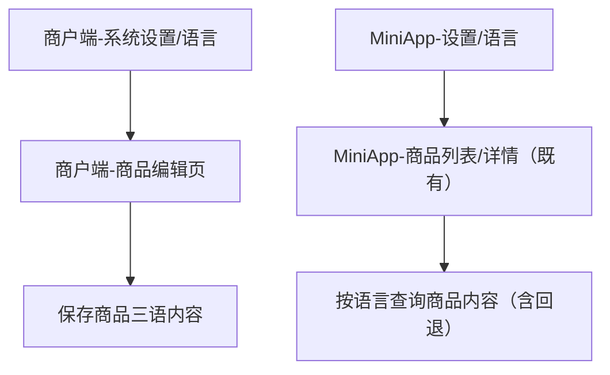

## 1. Product Overview
对 MiniApp 与商户端进行三语（可配置的 3 种语言）能力改造：支持端内语言切换、商户商品多语字段录入、后端与数据库多语存储与查询。
目标是让不同语言用户看到一致体验，并保证商品内容可按语言展示且可回退默认语言。

## 2. Core Features

### 2.1 User Roles
| 角色 | 注册/进入方式 | Core Permissions |
|------|--------------|------------------|
| 商户运营人员 | 既有商户账号登录商户端 | 可切换语言；可在商品编辑中维护三语字段；可查看按语言展示效果 |
| MiniApp 用户 | 无需区分（沿用既有登录态） | 可切换语言；可按所选语言浏览商品内容（含回退逻辑） |

### 2.2 Feature Module
本次多语言改造包含以下核心页面：
1. **商户端-商品编辑页**：三语字段录入、语言标签切换、校验与保存。
2. **商户端-系统设置/语言**：商户端界面语言切换、默认语言设置。
3. **MiniApp-设置/语言**：MiniApp 界面语言切换、影响商品展示语言。

### 2.3 Page Details
| Page Name | Module Name | Feature description |
|-----------|-------------|---------------------|
| 商户端-系统设置/语言 | 语言选择 | 选择三种语言之一作为当前界面语言；展示当前生效语言；保存到本地与用户偏好（如已登录）。 |
| 商户端-系统设置/语言 | 默认语言策略说明 | 展示“默认语言/回退语言”的说明（用于商品内容展示与必填校验的依据）。 |
| 商户端-商品编辑页 | 多语录入表单 | 在同一商品下维护三语字段（如名称/简介/详情等，字段范围以现有商品模型为准）；支持按语言 Tab 切换录入。 |
| 商户端-商品编辑页 | 校验与缺失提示 | 按规则校验必填：默认语言必填；非默认语言可选但需提示缺失；提交前汇总缺失项。 |
| 商户端-商品编辑页 | 保存与读取 | 保存时同时写入三语内容；打开编辑时按语言加载；支持仅更新当前语言或一次性更新全部语言（取决于现有保存方式）。 |
| MiniApp-设置/语言 | 语言选择 | 选择三种语言之一作为当前界面语言；写入本地缓存；如有用户体系则同步用户偏好。 |
| MiniApp-商品展示页（既有） | 按语言展示与回退 | 按当前语言展示商品字段；若该语言缺失则回退到默认语言；仍缺失则显示空态/占位。 |

## 3. Core Process
- 商户端语言切换流程：你在“系统设置/语言”选择语言 → 商户端 UI 文案立即切换 → 刷新后仍保持（本地缓存 + 用户偏好）。
- 商品多语维护流程：你进入商品编辑 → 通过语言 Tab 切换录入三语字段 → 系统对默认语言执行必填校验并提示其他语言缺失 → 保存后前台按所选语言展示。
- MiniApp 语言切换与展示流程：你在 MiniApp 设置里切换语言 → 商品列表/详情重新按语言拉取/渲染 → 若目标语言内容缺失则自动回退默认语言。

