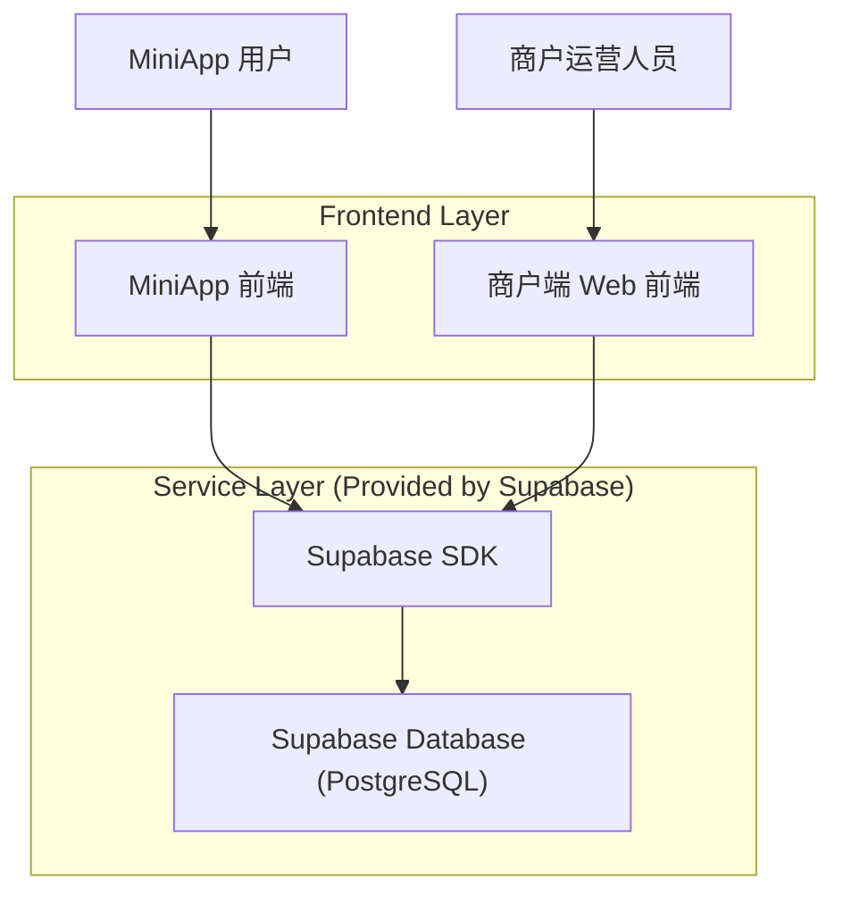
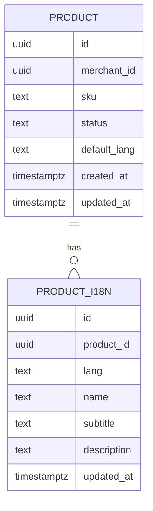

## 1.Architecture design


## 2.Technology Description
- Frontend（商户端）：React@18 + TypeScript + i18next（或同类 i18n 方案）
- Frontend（MiniApp）：沿用现有 MiniApp 技术栈 + i18n 资源包（JSON 字典）
- Backend：Supabase（Auth + PostgreSQL + Storage 如有）

## 3.Route definitions
| Route | Purpose |
|-------|---------|
| /settings/language | 商户端语言切换与默认语言说明 |
| /products | 商品列表（既有，需按语言展示字段） |
| /products/new | 新建商品（含三语字段录入） |
| /products/:id/edit | 编辑商品（含三语字段录入与缺失提示） |

## 6.Data model(if applicable)

### 6.1 Data model definition


### 6.2 Data Definition Language
Product 表（products）与多语表（product_i18n），不使用物理外键（逻辑关联 product_id）：

```sql
-- 语言 code 建议统一为应用配置的 3 个值（例如 zh-CN / en-US / xx-XX）

CREATE TABLE products (
  id UUID PRIMARY KEY DEFAULT gen_random_uuid(),
  merchant_id UUID NOT NULL,
  sku TEXT,
  status TEXT DEFAULT 'draft',
  default_lang TEXT NOT NULL,
  created_at TIMESTAMPTZ DEFAULT NOW(),
  updated_at TIMESTAMPTZ DEFAULT NOW()
);

CREATE TABLE product_i18n (
  id UUID PRIMARY KEY DEFAULT gen_random_uuid(),
  product_id UUID NOT NULL,
  lang TEXT NOT NULL,
  name TEXT,
  subtitle TEXT,
  description TEXT,
  updated_at TIMESTAMPTZ DEFAULT NOW(),
  UNIQUE (product_id, lang)
);

CREATE INDEX idx_product_i18n_product_id ON product_i18n(product_id);
CREATE INDEX idx_product_i18n_lang ON product_i18n(lang);

-- 典型查询策略：优先目标语言，缺失则回退默认语言
-- 说明：以下示例用 :lang 表示当前语言，products.default_lang 表示默认语言
-- 你可以封装为 view 或在前端用两次请求/一次 RPC 实现
CREATE VIEW v_product_i18n_resolved AS
SELECT
  p.id AS product_id,
  p.merchant_id,
  p.default_lang,
  COALESCE(t1.lang, t2.lang) AS resolved_lang,
  COALESCE(t1.name, t2.name) AS name,
  COALESCE(t1.subtitle, t2.subtitle) AS subtitle,
  COALESCE(t1.description, t2.description) AS description
FROM products p
LEFT JOIN product_i18n t1 ON t1.product_id = p.id
LEFT JOIN product_i18n t2 ON t2.product_id = p.id AND t2.lang = p.default_lang;

-- 权限（示例）：anon 可读，authenticated 全量
GRANT SELECT ON products TO anon;
GRANT SELECT ON product_i18n TO anon;
GRANT SELECT ON v_product_i18n_resolved TO anon;

GRANT ALL PRIVILEGES ON products TO authenticated;
GRANT ALL PRIVILEGES ON product_i18n TO authenticated;
GRANT ALL PRIVILEGES ON v_product_i18n_resolved TO authenticated;
```

补充约定（用于实现一致性）：
- 默认语言字段来源：优先用 merchant 级默认语言；商品可继承并允许覆盖（如你的业务已有该能力）。
- 写入规则：保存商品时 upsert `product_i18n (product_id, lang)`；默认语言必须写入完整必填字段。
- 读取规则：列表/详情读取时按 `lang` 优先取；缺失则回退 `default_lang`；仍缺失按前端空态处理。
