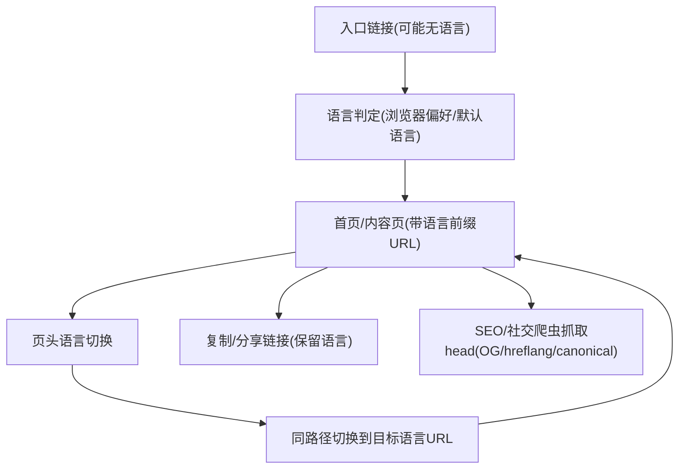

## 1. Product Overview
为官网提供高质量的三语（KH/中文/英文）内容呈现与一键语言切换，并确保分享链接、SEO 收录与站点文案维护方式在三语之间一致、可扩展、可长期维护。

## 2. Core Features

### 2.1 Feature Module
官网多语言需求由以下页面构成：
1. **首页（多语言版）**：全站导航、语言切换入口、首页核心文案区块、跳转到各内容入口。
2. **通用内容页（多语言版）**：承载“关于/产品/服务/新闻详情”等所有内容类型的统一模板、语言与路由联动、SEO 元信息输出。

### 2.3 Page Details
| Page Name | Module Name | Feature description |
|-----------|-------------|---------------------|
| 首页（多语言版） | 语言切换 | 切换 KH/中文/英文，并在全站生效；优先通过 URL 体现当前语言；在首次访问时按浏览器偏好选择默认语言（可被用户切换覆盖）。 |
| 首页（多语言版） | 语言保持 | 记住用户选择（Cookie/LocalStorage）；当用户从站内跳转时保持语言不丢失；当用户复制/分享链接时保留语言。 |
| 首页（多语言版） | 导航与入口一致性 | 在所有语言版本中保持信息架构一致（菜单项顺序、入口一致），仅文案与内容翻译变化。 |
| 首页（多语言版） | 文案展示一致性 | 同一组件在三语下使用同一“文案 Key”渲染，避免人工复制粘贴导致的遗漏与不一致。 |
| 通用内容页（多语言版） | 多语言路由 | 以语言前缀区分页面（例如 /zh-CN/... /en/... /km/...）；同一内容在不同语言下有对应的稳定 URL。 |
| 通用内容页（多语言版） | 内容与富文本结构 | 支持页面级分区块内容（标题/段落/列表/CTA 等）；同一页面在三语下结构一致，允许按语言单独调整少量排版细节（如换行）。 |
| 通用内容页（多语言版） | SEO 元信息 | 为每个语言版本输出独立 title/description/OG；输出 hreflang 互相指向；设置 canonical 避免重复收录。 |
| 通用内容页（多语言版） | 兜底与缺失提示 | 当某语言缺少某条文案/段落时，按约定回退到默认语言或显示可控的占位提示（区分“线上用户不可见”和“开发阶段可见”两种模式）。 |
| 通用内容页（多语言版） | 可维护的文案结构 | 规定统一的目录与命名规范（按 locale/page/namespace 组织）；支持组件级复用（common）与页面级文案隔离（page）。 |

## 3. Core Process
**访客浏览与切换语言流程**
1. 访客从搜索/社媒/直达链接进入：如果 URL 已包含语言前缀，则直接渲染对应语言页面。
2. 若 URL 不包含语言前缀：站点根据浏览器 Accept-Language 与站点支持语言进行匹配，选择默认语言并重定向到带语言前缀的 URL。
3. 访客点击页头语言切换：
   - 站点将当前路径映射到目标语言的同一页面 URL（保持 slug 不变或按规则映射）。
   - 写入语言偏好（Cookie/LocalStorage）。
4. 访客复制链接分享：链接天然包含语言前缀，打开即为该语言版本。

**SEO 抓取流程（搜索引擎/社交爬虫）**
1. 爬虫访问任一语言 URL：获取该语言的 title/description/OG。
2. 页面 head 输出 hreflang（en/zh-CN/km）互链，帮助爬虫识别语言版本关系。
3. canonical 指向当前语言 URL（或按策略统一指向主语言版本），避免重复内容干扰。

