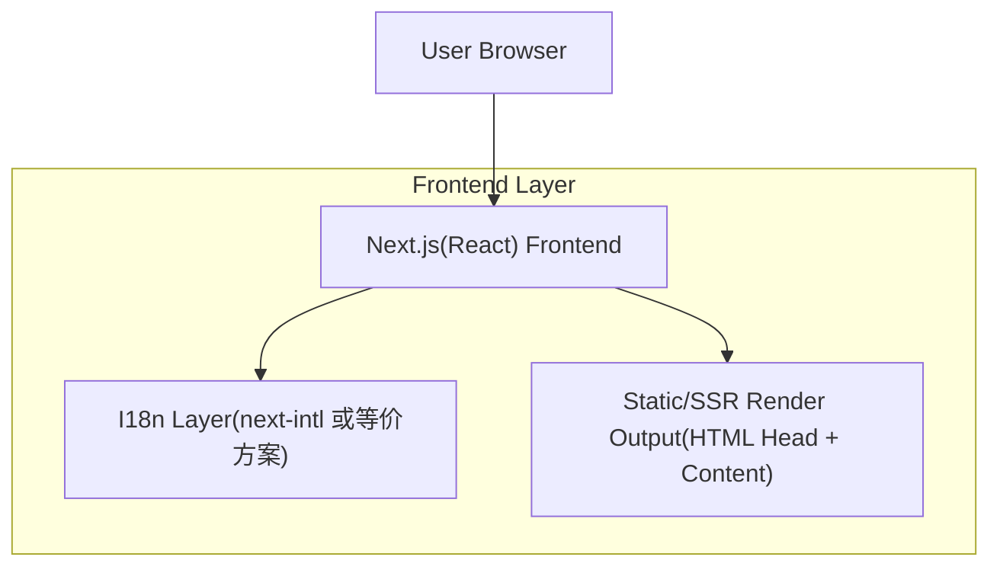

## 1.Architecture design

## 2.Technology Description
- Frontend: React@18 + Next.js@14(或同等 App Router 能力) + TypeScript + tailwindcss@3
- Backend: None（语言切换/SEO 输出在前端框架的 SSR/SSG 能力内完成）
- I18n: next-intl（推荐，支持 App Router + 基于路由的 locale）或 react-i18next（如你已有既定方案）

## 3.Route definitions
| Route | Purpose |
|-------|---------|
| / | 入口路由：根据 Cookie/Accept-Language 重定向到默认语言（例如 /zh-CN） |
| /:locale | 语言版首页（:locale ∈ km / zh-CN / en） |
| /:locale/:slug* | 语言版通用内容页（关于/产品/服务/新闻详情等统一模板） |
| /sitemap.xml | 生成多语言 URL 的站点地图（包含所有 :locale 变体） |
| /robots.txt | 搜索引擎抓取策略（允许抓取多语言路径） |

## 路由与语言判定策略（关键实现说明）
- **语言即路由状态**：当前语言优先由 URL 的 `:locale` 决定；这样分享/SEO 最稳定。
- **默认语言重定向**：当访问 `/` 或缺少 `:locale` 的路径时：
  1) 读取 Cookie（如 `site_locale`）
  2) 若无 Cookie，则解析 `Accept-Language`
  3) 匹配支持语言（km/zh-CN/en），否则回退到默认语言（建议 zh-CN）
  4) 302/307 重定向到 `/:locale/...`
- **语言切换映射**：切换时保持“同一页面语义”，尽量复用同一 `slug`；如存在多语言 slug 需求，使用可维护映射表（见“文案结构”）。

## 状态管理策略（Locale / 文案 / 路由）
- **单一真相来源**：locale 来自路由段 `:locale`。
- **偏好持久化**：切换语言时写 Cookie（服务端可读）+ 可选 LocalStorage（纯前端快速读取）。
- **文案加载**：按 `locale + namespace` 懒加载（例如 `common` + `home` + `page`），避免一次性加载全部语言。

## SEO 策略（必须输出）
- **每语言独立 meta**：`title/description/og:title/og:description/og:url` 依据 locale 输出。
- **hreflang**：在页面 head 输出 `rel="alternate" hreflang="km|zh-CN|en"`，互相指向对应语言 URL。
- **canonical**：默认指向“当前语言 URL”（推荐）；如你希望权重集中到主语言，可改为 canonical 指向主语言，但需保证 hreflang 完整且策略一致。
- **Sitemap**：`/sitemap.xml` 需要包含每个页面的三语 URL，并可在 `<xhtml:link rel="alternate" ...>` 中声明 alternates（如你使用生成器支持）。
- **索引一致性**：避免用查询参数 `?lang=` 做语言切换（不利于收录与分享稳定）。

## 可维护的文案结构（推荐目录与规范）
> 目标：同一组件/页面在三语下共享同一 key；结构清晰、可搜索、可扩展到更多语言。

**方案 A（推荐）：JSON/TS 字典 + namespace**
- 目录建议：
  - `src/i18n/locales/en/common.json`
  - `src/i18n/locales/en/home.json`
  - `src/i18n/locales/en/pages.json`（通用内容页块）
  - `src/i18n/locales/zh-CN/...`
  - `src/i18n/locales/km/...`
- Key 规范：
  - `common.nav.about`、`home.hero.title`、`pages.about.section1.title`
  - 只改 value 不改 key；key 一旦发布尽量稳定。
- 变量插值：使用 `{brand}` `{year}` 等参数，避免把可变信息写死在三语里。

**方案 B：按页面用 MDX/Markdown 管理富文本（如新闻/长文）**
- 目录建议：
  - `src/content/en/about.mdx`
  - `src/content/zh-CN/about.mdx`
  - `src/content/km/about.mdx`
- 适用：长文、富文本、图文混排；缺点是组件级复用较弱。

## 4.API definitions (If it includes backend services)
无（不引入独立后端服务）。

## 5.Server architecture diagram (If it includes backend services)
无。

## 6.Data model(if applicable)
无数据库设计。