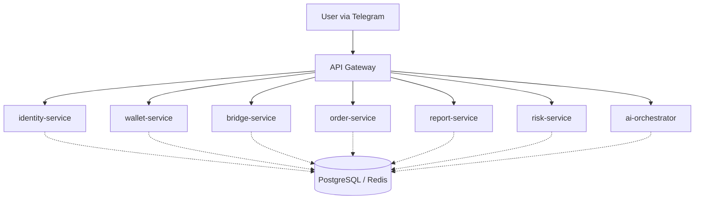

# RainbowPaw - Pet Lifecycle Operational System

## 1. Core Philosophy & Business Model
RainbowPaw is **NOT** just a pet e-commerce or a lottery (claw machine) platform. It is a **"Pet Lifecycle Operational System"** designed to capture users through low-barrier interactions, cultivate trust, generate recurring revenue through subscriptions, and ultimately provide high-value, high-trust aftercare (bereavement) services.

### The Conversion Path (Revenue Funnel)
1. **TikTok / Ads** (Acquisition)
2. **Claw Bot** (Low-barrier entry, lucky draw)
3. **Pet Profiling** (Mandatory data collection: cat/dog, age `elder_pet`, weight, diseases)
4. **Product Recommendation** (Shop)
5. **Senior Care Subscription** (Core Revenue: Monthly Care Pack $29-$50)
6. **Bridge to RainbowPaw Bot** (Trust building, deep services)
7. **Aftercare & Bereavement Services** (High-margin, emotional service)
8. **Memorial System** (Anniversary reminders, long-term retention/repurchase)

## 2. System Architecture (Microservices)
The system adopts a microservices architecture communicating via an API Gateway.

### Microservices Responsibilities
*   **identity-service**: Manages global users, tags (`elder_pet`), and pet profiles.
*   **wallet-service**: Manages points, cashable balances, withdrawals, and wallet logs.
*   **bridge-service**: Generates tokens and deep links for cross-bot routing (Claw -> RainbowPaw).
*   **order-service**: Centralized order management for claw rewards, shop products, and service bookings.
*   **report-service**: Aggregates daily metrics (revenue, profit, plays) for the Admin Bot/Console.
*   **risk-service**: Monitors anomalous wins, suspicious withdrawals, and freezes users.
*   **ai-orchestrator**: Coordinates Support AI (CS), Ops AI, Product AI, Recommendation AI, and Risk AI.

## 3. API Gateway Contract (Frontend Bot <-> Backend)

### Identity / User
*   `POST /api/user/register` - Register user via Bot.
*   `POST /api/user/pet-profile` - Update pet info and auto-tag (e.g., `elder_pet=true`).

### Claw System
*   `POST /api/claw/play` - Deduct 3 points, return reward and remaining points.
*   `POST /api/claw/recycle` - Recycle reward into locked/cashable points.

### Wallet System
*   `GET /api/wallet/:globalUserId` - Check balances.
*   `POST /api/wallet/withdraw` - Request USDT withdrawal (deducts `points_cashable`).

### Care System (Core Profit)
*   `POST /api/care/plan` - AI generates a personalized care plan (e.g., Joint Support).
*   `POST /api/care/subscribe` - Subscribe to a Monthly Care Pack.

### Shop & Services
*   `GET /api/shop/products` - List products (filtered by `category=senior`).
*   `POST /api/shop/order` - Purchase physical items.
*   `GET /api/service/list` - List aftercare/memorial services.
*   `POST /api/service/book` - Book an aftercare service (creates order & booking).

### Bridge
*   `POST /api/bridge/create` - Generate a deep link (`t.me/RainbowPawBot?start=token`).
*   `GET /api/bridge/resolve?token=...` - Resolve cross-bot navigation context.

## 4. Database ER Model (Schema Separation)

The database (PostgreSQL) is logically separated by schemas. 
**P0 Core Schemas:** `identity`, `wallet`, `bridge`, `order`, `claw`

### `identity` Schema
*   `users` (PK: `global_user_id`)
*   `user_bot_mapping` (1:N from users)
*   `user_tags` (1:N from users - e.g., `elder_pet`)
*   `user_profiles` (1:1 from users - pet details snapshot)

### `wallet` Schema
*   `wallets` (1:1 from users, PK: `global_user_id`)
*   `wallet_logs` (1:N from wallets)
*   `withdraw_requests` (1:N from wallets)
*   `business_settings` (Global config for exchange rates, fees)

### `order` Schema
*   `orders` (1:N from users, PK: `order_id`)
*   `order_items` (1:N from orders)
*   `order_status_logs` (1:N from orders)

### `claw` Schema
*   `claw_pools` & `claw_pool_items`
*   `claw_plays` (1:N from users & pools) -> Triggers `wallet_logs` & `orders`
*   `claw_rewards`

### `bridge` Schema
*   `bridge_tokens` & `bridge_events` (Tracking user jumps between bots)

### `store` & `service` Schemas (High Margin)
*   `products`, `product_categories` (Focus: Senior Care, Recovery, Emotional items)
*   `service_items`, `service_bookings` (Aftercare coordination, tracking)
*   `memorial_pages` (1:N from users - for long-term retention)
*   `cemetery_zones`, `cemetery_slots`
